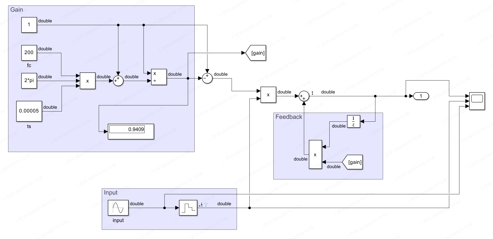
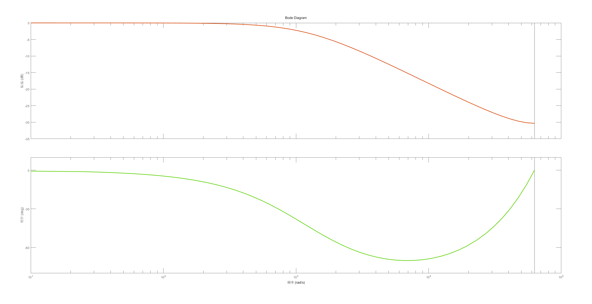
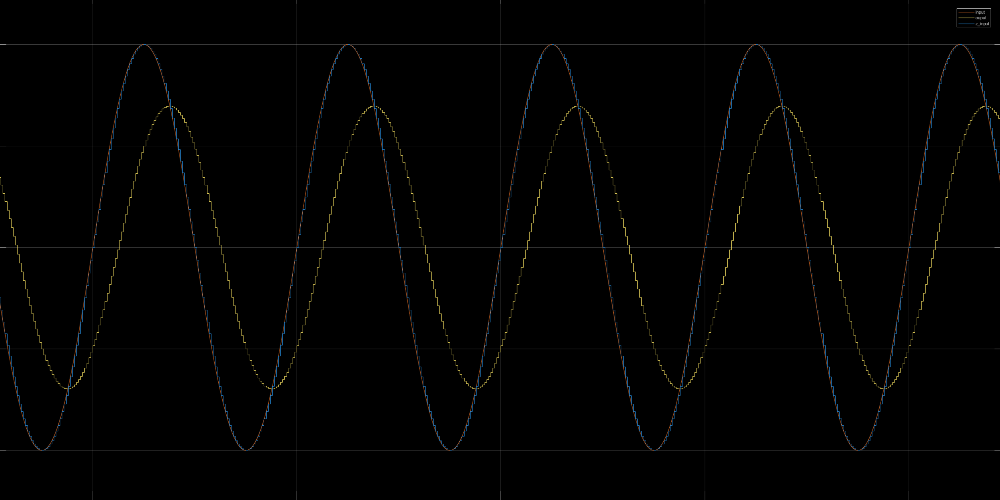
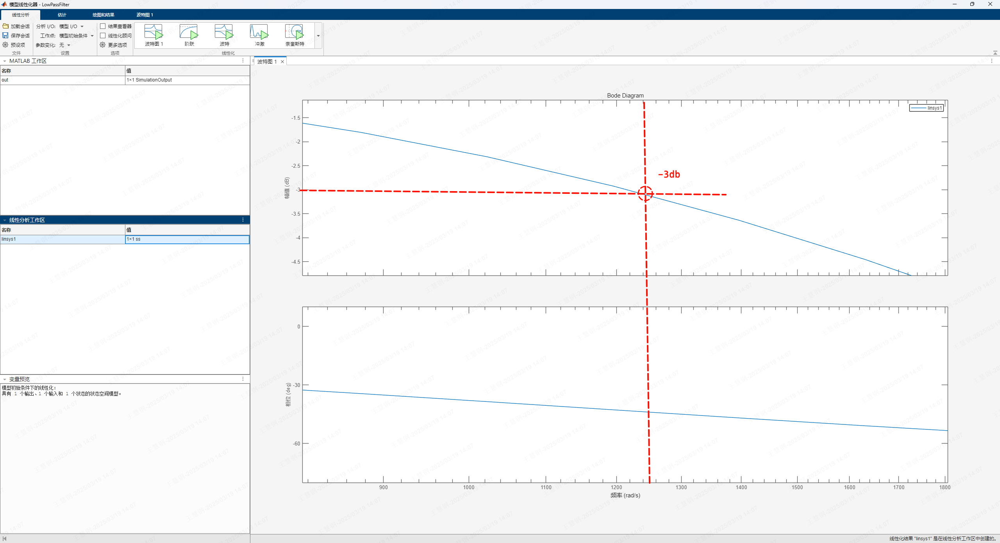

# 执行器介绍

下文介绍中涉及的相关物理量符号说明如下表：
|      符号       |                    值                     |         单位         |       释义       |
| :-------------: | :---------------------------------------: | :------------------: | :--------------: |
|     $q_{d}$     |                   变量                    |      $\rm{rad}$      |     目标位置     |
|       $q$       |                   变量                    |      $\rm{rad}$      |     反馈位置     |
|    $q_{err}$    |                   变量                    |      $\rm{rad}$      |     位置误差     |
|  $\dot{q_{d}}$  |                   变量                    |     $\rm{rad/s}$     |     目标速度     |
|    $\dot{q}$    |                   变量                    |     $\rm{rad/s}$     |     反馈速度     |
| $\dot{q}_{err}$ |                   变量                    |     $\rm{rad/s}$     |     速度误差     |
|  $I_{q_{set}}$  |                   变量                    |       $\rm{A}$       | 目标 $q$ 轴电流  |
|     $I_{q}$     |                   变量                    |       $\rm{A}$       | 反馈 $q$ 轴电流  |
|    $\tau_d$     |                   变量                    |   $\rm{N \cdot m}$   |     目标力矩     |
|  $T_{\omega}$   |                   $0.1$                   |      $\rm{ms}$       |  速度环控制周期  |
|     $K_{t}$     |         常量（由执行器型号决定）          |          -           | 电流力矩转换系数 |
|       $r$       |         常量（由执行器型号决定）          |          -           |      减速比      |
|    $N_{pp}$     |         常量（由执行器型号决定）          |          -           |      极对数      |
|  $G_{\omega}$   |                    $1$                      |          -           |   速度转换系数   |

## 执行器控制模式

### 电流模式

### 速度模式

### 位置模式

$$
I_{q_{set_{j}}} = r K_{d}^{series} (r K_{p}^{series} q_{err}- \dot{q} G_{\omega})
$$

$$
\rm{(A) = (\frac{A \cdot s}{rad}) \left((\frac{1}{s})(rad) - (\frac{rad}{s}) \right)}
$$

- $K_{p}^{series}: \rm{\frac{1}{s}}$
- $K_{d}^{series}: \rm{\frac{A \cdot s}{rad}}$

位置模式下如果将速度环的积分系数设置为 0，则等价于**串联 PD**。

### PD 模式

$$
I_{q_{set_{j}}} = \frac{(K_{p}^{parallel} q_{err} - K_{d}^{parallel} \dot{q})}{K_{t}}
$$

$$
\rm{(A) = \frac{(\frac{Nm}{rad}) (rad) - (\frac{Nm \cdot s}{rad}) (\frac{rad}{s})}{(\frac{Nm}{A})}}
$$

- $K_{p}^{parallel}: \rm{\frac{Nm}{rad}}$
- $K_{d}^{parallel}: \rm{\frac{Nm \cdot s}{rad}}$

## 执行器其他功能

### PVCT 反馈滤波

| 默认截止频率 fc (Hz) | 增益 gain                        | 周期 ts (s)               |
| -------------------- | -------------------------------- | ------------------------- |
| 200（用户可调节）    | 0.9409（根据截止频率和周期计算） | 5e-5（20KHz 与 FOC 同频） |

$$
gain = \frac{1}{(1 + 2 \pi f_{c} T_{s})}
$$

$$
out_{j} = (1 - gain) \cdot input_{j} + gain \cdot out_{j - 1}
$$

> 该滤波会导致反馈数据延迟，所以尽量不要在自己用户程序中再叠加一个滤波，或者将该滤波截止频率设置的尽可能大以避免影响。

输入信号：200Hz 正弦

### 负载观测器

开启负载补偿后，执行器的低速性能将大大提升，若负载补偿参数调整合适，在极低的转速下（1 deg/s 以下）能够维持很小的速度波动。

